  

  
  
  

### About

- 東京工科大学大学院 バイオ・情報メディア研究科 コンピュータサイエンス専攻 修士1年
- 研究テーマはコンピュータビジョン 特に自由視点画像生成と3次元再構成
- 株式会社neoAIのAIエンジニアとして企業向けAIX支援に従事
- NVIDIA学生アンバサダー（2026.04〜）

### Highlights

- **Research** FrugalNeRFを基盤とした 少数視点3次元再構成におけるノイズ（floater）低減手法の研究
- **Work** コンサルティングからAIシステムの開発・導入まで 企業のAIXを一貫して支援 画像生成AI共同研究プロジェクトにて1テーマのリードを約1年間担当
- **Talk** NVIDIA学生アンバサダーワークショップ（2026.08）にて instant-ngpを用いたメッシュ化について発表 [→ 開催報告](https://www.teu.ac.jp/information/2026.html?id=216)
- **Award** 学部長賞 Stable Diffusionを用いた画像生成Slackbot

### Tech Stack

  
  
  
  
  
  
  
  
  
  
  
  

<b>English</b>

- First-year master’s student, Computer Science Program, Graduate School of Bionics, Computer and Media Sciences, Tokyo University of Technology
- Research: computer vision, with a focus on novel view synthesis and 3D reconstruction
- AI Engineer at neoAI Inc., supporting enterprise AI transformation (AIX) from consulting to deployment
- NVIDIA Student Ambassador (Apr 2026 –) — presented “Mesh Generation with instant-ngp” at the NVIDIA Student Ambassador Workshop (Aug 2026)
- Dean’s Award for an image-generation Slackbot powered by Stable Diffusion

